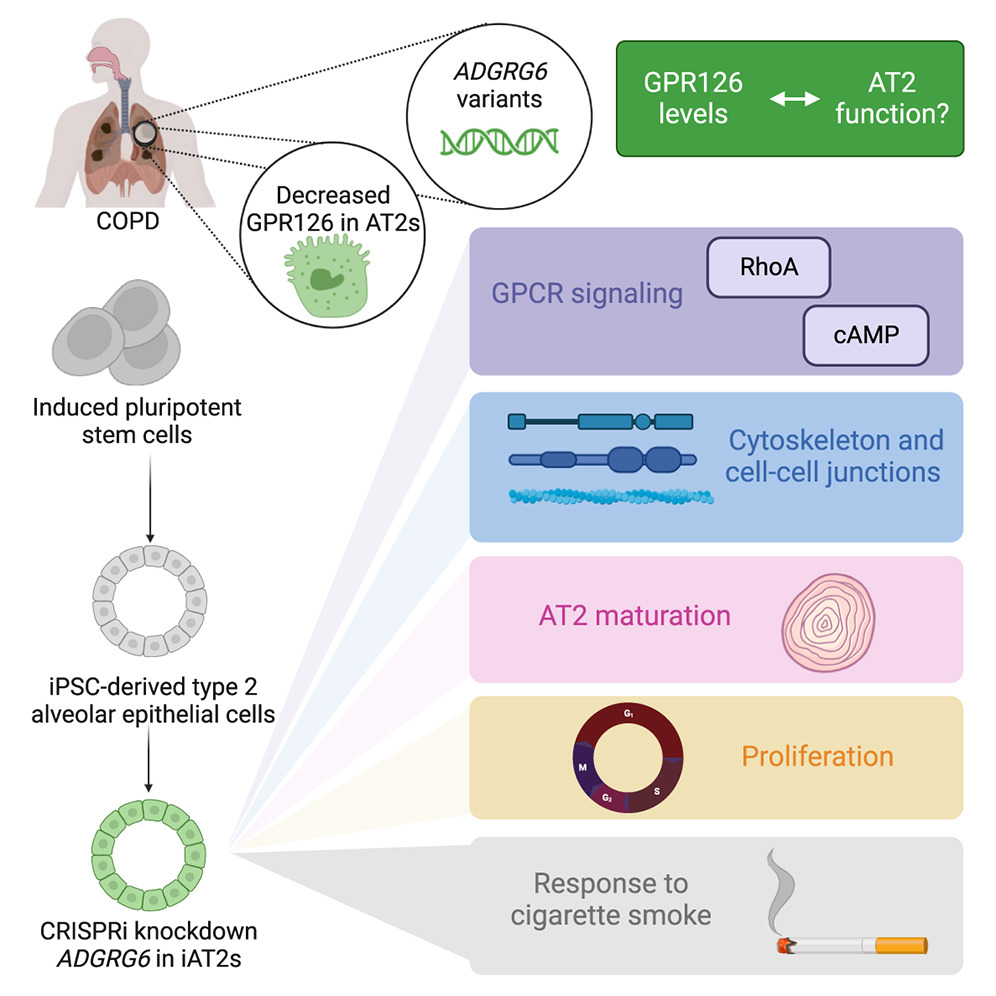

<style>
body {
  font-size: 16px;
}

caption {
  font-size: 14px;
  font-style: italic;
}
</style>

```{r setup, include=FALSE}
knitr::opts_chunk$set(
  echo = TRUE,
  warning = FALSE,
  message = FALSE,
  fig.align = "center"
)


# Load library
library("biomaRt")
library("ComplexHeatmap")
library("dplyr")
library("edgeR")
library("GEOquery")
library("ggplot2")
library("knitr")
library("RColorBrewer")
library("rmarkdown")
library("tidyr")
library("tibble")


# Helper function for plotting modified based on lecture exercise
plot_box <- function(mat, main = "", xlab = "Sample", ylab = "log2(counts+1)") {
  df <- as.data.frame(mat)
  df_long <- df |>
    mutate(gene = rownames(df)) |>
    pivot_longer(-gene, names_to = "sample", values_to = "value") |>
    mutate(value = log2(value + 1))
  
  ggplot(df_long, aes(x = sample, y = value)) +
    geom_boxplot(outlier.size = 0.2) +
    theme_bw() +
    theme(axis.text.x = element_text(angle = 90, vjust = 0.5, hjust = 1)) +
    labs(title = main, x = xlab, y = ylab)
}


plot_density <- function(mat, main = "", xlab = "log2(counts+1)", ylab = "Density") {
  df <- as.data.frame(mat)
  df_long <- df |>
    mutate(gene = rownames(df)) |>
    pivot_longer(-gene, names_to = "sample", values_to = "value") |>
    mutate(value = log2(value + 1))
  
  ggplot(df_long, aes(x = value, colour = sample)) +
    geom_density() +
    theme_bw() +
    labs(title = main, x = xlab, y = ylab) +
    guides(colour = "none")
}
```

---

# Introduction {#introduction}

Watching my father smoke 2–3 packs a week and hearing that heavy, persistent 
cough every day makes the biology of lung disease feel incredibly personal. 
While researchers often describe cigarette smoke as a primary environmental 
catalyst for chronic respiratory pathologies like COPD, fibrosis, and lung 
cancer [@barnes2017cellular], I see the real-world version of that oxidative 
stress and inflammation every time he struggles to catch his breath. It is not 
just a public health statistic to me; it is a daily reminder of the immense 
pressure we put on our lung cells.

<br>

<div align="center">
  
  <p><strong>Figure 1.1: Smoke from cigarette (Lukas, n.d.)</strong></p>
</div>

<br>

This personal connection is why I chose a study specifically focused on the 
effects of cigarette smoke for this assignment. This research centers on the 
true "first responders" of our lungs: Alveolar Type 2 (AT2) cells. These cells 
act as the essential defense and repair crew for the tiny air sacs where we 
breathe. Specifically, the authors investigated a gene called **ADGRG6** 
(also known as GPR126), a "mechanosensor" that helps lung cells maintain 
stability and repair themselves after injury [@karlsson2013gpr126]. When this 
gene is disrupted,the lungs become significantly more vulnerable to 
environmental damage [@karlsson2013gpr126].

To explore how this gene influences lung function under both normal air and 
cigarette smoke conditions in humans, @werder2023adgrg6 started an ivestigation
utilizing induced iAT2s—lab-grown versions derived from pluripotent stem cells(PSC).

<br>

<div align="center">
  
  <p><strong>Figure 1.2: Experiment Overview</strong> [@werder2023adgrg6]</p>
</div>

<br>

These "blank slate" cells underwent a multi-stage directed differentiation 
protocol—moving from definitive endoderm to NKX2-1+ lung progenitors—using a 
precise cocktail of growth factors (such as BMP4 and CHIR99021) and 3D Matrigel 
culture to mature into functional Alveolar Type 2 (iAT2) cells 
[@werder2023adgrg6]. To investigate the role of the COPD-linked gene ADGRG6, 
the team employed a doxycycline-inducible CRISPR interference (CRISPRi) system 
delivered via lentivirus; this targeted the gene's transcription start site to 
achieve a 20%–50% reduction in expression, effectively mimicking the partial 
loss of function seen in genetic risk factors [@werder2023adgrg6].

### Experimental Design and Dataset Summary
The researchers employed a **2x2 factorial design** to test the interaction 
between genetic knockdown and environmental stress:

- **Genotype:** CRISPRi knockdown of *ADGRG6* versus a non-targeting Wild-Type (WT) control.
- **Exposure:** 24-hour treatment with cigarette smoke extract (CSE) versus a standard air control.

The experiment includes **12 samples** in total, with 
**three biological replicates per condition** [@werder2023adgrg6]. 
This structure provides the statistical power necessary to distinguish between 
baseline shifts caused by the *ADGRG6* deficiency and the acute transcriptional 
responses triggered by smoke exposure [@werder2023adgrg6].


### Project Goals
This report presents an independent computational analysis of the **GSE223077** 
dataset [@werder2023adgrg6]. By re-processing the raw count data through my own 
differential expression pipeline, I aim to validate the authors' findings and 
further investigate the specific genetic trends in expression. 


---

# Explore Datasets {#exploration}

## Dataset Selection {#ds_select}

The **GSE223077** dataset was qualified for this project because it provides a high-quality, high-resolution framework for investigating gene–environment interactions in the human lung. 

The selection matches the following instructed criteria:

* **Human Cell Model:** The experiment utilizes human iPSC-derived type II alveolar epithelial cells (iAT2s), a sophisticated model that accurately reflects the cellular environment of the human lung [@werder2023adgrg6].
* **Biological Relevance:** The experiment models a meaningful physiological response by combining a **genetic perturbation** (CRISPRi knockdown of the COPD-associated GWAS gene *ADGRG6*) with an **environmental exposure** (cigarette smoke) [@werder2023adgrg6]. This interaction mirrors the clinical reality of chronic lung disease, where genetic vulnerability meets toxic exposure—a scenario particularly relevant given the environmental stressors impacting my father's lung health.
* **Transcriptomic Coverage:** The data was generated via bulk RNA-seq, providing complete coverage of the protein-coding transcriptome (mapping to **20,530** validated HUGO genes in my pipeline), ensuring the analysis is not limited to a small subset of genes [@werder2023adgrg6].
* **Experimental Quality:** The study is recent (published in **2023**) and adheres to best-practice procedures, including the use of **three biological replicates** per condition across four experimental groups.

By integrating CRISPRi-mediated knockdown with environmental assault, this dataset offers a biologically robust platform to explore how the loss of a key mechanosensor (*ADGRG6*) predisposes human lung cells to injury from cigarette smoke.

---

## Downloading the dataset {#ds_dl}

The dataset was downloaded programmatically using the *getGEOSuppFiles* function from **GEOquery** package from Bioconductor [@robinson2010edger].

```{r}
# Download supplementary files
GSE_ID <- "GSE223077"
getGEOSuppFiles(GSE_ID, makeDirectory = TRUE, baseDir = "data")
```

After downloading, the count matrix is identified and loaded:

```{r}
# Set file path
counts_file <- file.path("data", GSE_ID, "GSE223077_counts.tab.gz")

# Stop if download failed
stopifnot(file.exists(counts_file))

# Load table
counts <- read.table(counts_file, header = TRUE, row.names = 1, sep = "\t", check.names = FALSE)
```

A subset of the dataset is shown below:

```{r}
head(counts)
```

Table 2.1: This table shows the genetic symbol and raw transcript counts for the first six genes across a subset of the dataset. Rows represent genes identified by their various kind of symbols (e.g., MIR1302-2HG, FAM138A), and each column represents one of the twelve experimental samples. The numeric values denote the raw number of reads mapped to that specific gene locus before any normalization or filtering steps were applied.

<br>

Metadata is constructed to define experimental conditions:

```{r}
metadata <- data.frame(
  sample   = names(counts),
  genotype = c(
    "WT","WT","WT",                     # 1–3
    "ADGRG6_kd","ADGRG6_kd","ADGRG6_kd", # 4–6
    "WT","WT","WT",                     # 7–9
    "ADGRG6_kd","ADGRG6_kd","ADGRG6_kd"  # 10–12
  ),
  exposure = c(
    "Air","Air","Air",                  # 1–3
    "Air","Air","Air",                  # 4–6
    "Smoke","Smoke","Smoke",            # 7–9
    "Smoke","Smoke","Smoke"             # 10–12
  ),
  stringsAsFactors = FALSE
)

knitr::kable(metadata)
```
Table 2.2: This table shows the experimental design and sample metadata for the GSE223077 series. Each row represents a unique RNA-seq library, and columns define the specific variables for each sample. 'Genotype' indicates whether the human iAT2 cells were Wild-Type (WT) or subjected to CRISPRi-mediated knockdown of the ADGRG6 mechanosensor (ADGRG6_kd). 'Exposure' identifies the treatment condition: Air (control) or Cigarette Smoke (test). The 'Sample' IDs correspond to the column names in the raw count matrix, where numbers 1–12 represent independent biological replicates.

<br>

Design was set to model genotype effects and smoke effects.

```{r}
metadata$group <- factor(paste(metadata$genotype, metadata$exposure, sep = "_"))
design <- model.matrix(~ 0 + group, data = metadata)
```

---

# Data Cleaning and ID Mapping {#cleaning_mapping}

## Data Quality Overview

Library size (read depth) per sample:

```{r}
library_sizes <- colSums(counts)
library_sizes
```

As library size ranges from 40000000 to 80000000, normalization is required to address such inequality.

---

## Raw Boxplot & Density plot [@norm_exercise] {#raw_plot}

**Boxplot:**
```{r, fig.cap="Boxplot showing the distribution of log2-transformed raw read counts for all twelve samples in GSE223077. The x-axis represents individual samples, while the y-axis shows log2(gene expression counts + 1). The plot illustrates the baseline variation in library sizes and the presence of lowly expressed genes (near zero) prior to TMM normalization and filtering."}

plot_box(counts, 
         main = "GSE223077 Log2 Gene Expression Raw Counts Boxplot",
         ylab = "Log2 Gene Expression (Counts + 1)")
```

**Density Plot:**
```{r, fig.cap="Density plot showing the frequency distribution of log2-transformed raw counts across the entire dataset. Each colored line represents one sample's transcriptomic profile. The prominent peak on the left side of the x-axis indicates a high proportion of genes with zero or very low expression, highlighting the necessity of the filterByExpr step to remove noise from the analysis."}

plot_density(counts, 
             main = "GSE223077 Log2 Gene Expression Raw Counts vs Density Plot",
             xlab = "Log2 Gene Expression (Counts + 1)")
```

---

## Identity mapping {#mapping}

As this dataset used a mix of identifiers includes:

- HUGO (e.g. A3GALT2)
- Ensembl-style novel locus / predicted gene (e.g. AL137802.1)
- Long intergenic non-coding RNA (lncRNA) (e.g. LINC01646)
- Chromosome open reading frame (protein-coding) (e.g. C1orf159)

Mapping to HUGO was done using biomRt [@durinck2009mapping].
Other non HUGO attributes was unable to be mapped to HUGO symbols. Therefore, 
we will be analyzing those with valid HUGO identifiers only(~ 2/3 of the whole set).

```{r}
# Connect to Ensembl (Human dataset)
ensembl <- useMart("ensembl", dataset = "hsapiens_gene_ensembl")

# Retrieve all valid HGNC symbols
hgnc_list <- getBM(attributes = "hgnc_symbol", mart = ensembl)

# Check if the row name from count in the official HGNC list?
# Note: we filter out empty strings which biomaRt sometimes returns
valid_hgnc_list <- hgnc_list$hgnc_symbol[hgnc_list$hgnc_symbol != ""]
is_hugo <- rownames(counts) %in% valid_hgnc_list

# Separate the matrices by whether is HUGO symbol
counts_hugo  <- counts[is_hugo, ]
counts_other <- counts[!is_hugo, ]

# Summary
cat("Validated HUGO genes:", nrow(counts_hugo), "\n")
cat("Non-HGNC/Others:", nrow(counts_other), "\n")
```

---

## Verifying no duplicates {#any_dupes}

```{r}
# Check if ANY duplicates exist (Returns TRUE or FALSE)
any_dupes <- any(duplicated(rownames(counts_hugo)))
cat("Are there duplicate row names?", any_dupes, "\n")

# If TRUE, see how many duplicates there are
if(any_dupes) {
  num_dupes <- sum(duplicated(rownames(counts_hugo)))
  cat("Number of duplicate rows:", num_dupes, "\n")
  
  # 3. Identify the specific duplicated gene symbols
  duplicate_genes <- rownames(counts_hugo)[duplicated(rownames(counts_hugo))]
  print("First few duplicated genes:")
  print(unique(duplicate_genes))
}
```


## Filtering lowly-expressed genes {#filter_low}

Low-expression genes are filtered using *filterByExpr* from **edgeR** [@robinson2010edger].
Filtering these "transcriptomic outliers" is a critical prerequisite for 
differential expression testing, as it increases statistical power by reducing 
the burden of multiple hypothesis testing and eliminates the heteroscedasticity 
typically associated with near-zero counts.

```{r}
# Create a DGEList (edgeR data container)
dge <- DGEList(counts = counts_hugo)

# Attach metadata
dge$samples <- cbind(dge$samples, metadata)

# Filter lowly expressed genes
keep <- edgeR::filterByExpr(dge, design)
dge_f <- dge[keep, , keep.lib.sizes = FALSE]

# Check filter result
nrow(dge)
nrow(dge_f)
```

---

# Normalisation {#normalization}

I applied Weighted Trimmed Mean of M-values (TMM) normalization to the dataset 
to correct for composition biases that arise when a small number of highly 
expressed genes consume a disproportionate share of the total sequencing depth [@robinson2010edger].
By calculating a scaling factor based on the weighted mean of log-expression 
ratios after trimming the top and bottom 30% of extreme values, TMM ensures 
that the relative abundance of genes is comparable across libraries with varying
sizes, ranging from 42M to 79M reads. This step is critical for my analysis 
because it prevents technical artifacts—such as differences in total RNA 
production or sequencing efficiency—from being misinterpreted as biological 
responses to cigarette smoke.

```{r}
dge_f <- edgeR::calcNormFactors(dge_f, method = "TMM")
```

**The final result:**

```{r}
head(dge_f$counts)
```
Table 4.1: The final data frame as required by Assignment 1 instructions.

  - A dataframe with x numeric columns.
  - All rows have a unique HUGO symbols, 
  - HUGO symbols are defined as rownames of the dataframe.

<br>

## Post-normalisation visualisation: {#post_plot}

**Boxplot (Post-normalization):**

```{r, fig.cap="Boxplot showing the distribution of log2-transformed counts per million (CPM) following TMM (Trimmed Mean of M-values) normalization and filtering. Compared to the raw counts, the medians and quartiles are now aligned across all samples, ensuring that technical differences in sequencing depth do not bias the subsequent differential expression analysis of the 15,080 retained genes."}


plot_box(dge_f, 
         main = "GSE223077 Log2 Gene Expression Counts Boxplot (Post Norm)",
         ylab = "Log2 Gene Expression (Counts + 1)")
```

**Density Plot (Post-normalization):**
```{r, fig.cap="Density plot of TMM-normalized log2-CPM values. The alignment of the peaks across all twelve samples confirms that the normalization process successfully standardized the expression distributions, allowing for valid comparisons of gene activity between the Air-exposed and Smoke-exposed lung cell conditions."}

plot_density(dge_f, 
             main = "GSE223077 Log2 Gene Expression Counts vs Density plot",
             xlab = "Log2 Gene Expression (Counts + 1)")
```


---

# Exploratory analysis {#analysis}

## MDS plot (Combined Group Analysis) [@robinson2010edger] {#mds}

```{r, fig.cap="Multi-dimensional Scaling (MDS) plot showing the leading log-fold change between samples based on the top 500 genes with the highest biological coefficient of variation in the GSE223077 dataset. Each point represents an individual RNA-seq library labeled by its experimental group: ADGRG6_kd_Air (Red), ADGRG6_kd_Smoke (Blue), WT_Air (Green), and WT_Smoke (Purple). By focusing on the top 500 most variable genes, the plot filters out stochastic background noise across the 15,080 genes to highlight the most dominant biological signals. The x-axis (Dimension 1) accounts for 36% of the total transcriptomic variance, primarily separating the samples by Genotype; this high percentage indicates that the CRISPRi-mediated loss of the ADGRG6 mechanosensor is the single most significant driver of cellular change in this experiment."}


# Create a combined factor for all 4 conditions
metadata$group <- factor(paste(metadata$genotype, metadata$exposure, sep = "_"))

# Set up colors for 4 groups
group_levels <- levels(metadata$group)
group_colors <- RColorBrewer::brewer.pal(n = 4, "Set1")
names(group_colors) <- group_levels

# Allos legend to be outside the image
par(xpd = NA)
par(mar = c(5, 4, 4, 12))

# Generate the MDS plot
plotMDS(dge_f,
  labels = metadata$group,
  col = group_colors[as.character(metadata$group)],
  main = "MDS plot (Combined Group Analysis)",
  xlab = "MDS Dimension 1 (36% variance explained)",
  ylab = "MDS Dimension 2 (18% variance explained)"
)

mtext("WT: Wild-Type, ADGRG6-kd: ADGRG6 knockdown", side = 3, line = 0.5, cex = 0.7)

# Add the legend
legend("topright",
  inset = c(-0.45, 0),
  legend = names(group_colors),
  col = group_colors,
  pch = 16,
  bty = "n",
  cex = 0.8
)

# Reset to disallow further out of bound
par(xpd = FALSE)
```

## log-CPM summary {#log_cpm}
Transforming the raw transcript counts into log2-counts per million (log-CPM) 
using the edgeR package was performed to normalize the data for varying 
sequencing depths, which in this dataset ranged from 42,795,266 to 79,857,520 
reads per library [@robinson2010edger].

```{r}
lcpm <- edgeR::cpm(dge_f, log = TRUE, prior.count = 1)
summary(as.vector(lcpm))
```

This provides an overview of expression distribution and variability.

---

# Differential gene expression

## Fitting the QL model
Following the log-CPM transformation, differential expression analysis is 
performed using the **edgeR quasi-likelihood pipeline** [@robinson2010edger] .

```{r}
dge_f <- estimateDisp(dge_f, design)
fit <- glmQLFit(dge_f, design)
```

---

## BCV plot [@robinson2010edger] {#bcv}

Biological Coefficient of Variation (BCV) plot shows the relationship between 
gene abundance (Average Log CPM) and the variability between biological replicates. 

```{r, fig.cap="The 'Common' dispersion (red line) and 'Trended' dispersion (blue line) provide an estimate of the overall noise in the dataset, which is used by the edgeR model to distinguish true biological changes from technical or stochastic variation."}

plotBCV(dge_f)
```


## Test the contrast {#contrast}

**Example contrast with edgeR [@robinson2010edger] :**
```{r}
contrast <- makeContrasts(
  "Air_vs_Smoke" = groupWT_Air - groupWT_Smoke,
  "ADGRG6_kd_vs_WT" = groupADGRG6_kd_Air - groupWT_Air,
  "ADGRG6_kd_Smoke_vs_WT_Air" = groupADGRG6_kd_Smoke - groupWT_Air,
  levels = design
)

qlf_air_vs_smoke <- glmQLFTest(fit, contrast = contrast[, "Air_vs_Smoke"])
qlf_kd_vs_wt <- glmQLFTest(fit, contrast = contrast[, "ADGRG6_kd_vs_WT"])
qlf_kd_smoke_vs_wt_air <- glmQLFTest(fit, contrast = contrast[, "ADGRG6_kd_Smoke_vs_WT_Air"])

tab_air_vs_smoke <- topTags(qlf_air_vs_smoke, n = Inf)$table %>% rownames_to_column("hgnc_symbol")
tab_kd_vs_wt <- topTags(qlf_kd_vs_wt, n = Inf)$table %>% rownames_to_column("hgnc_symbol")
tab_kd_smoke_vs_wt_air <- topTags(qlf_kd_smoke_vs_wt_air, n = Inf)$table %>% rownames_to_column("hgnc_symbol")

knitr::kable(head(tab_air_vs_smoke))
```
Table 6.1: This table showing the top 6 differentially expressed genes for the comparison between Wild-Type (WT) Air and WT Smoke exposure, calculated using the edgeR quasi-likelihood F-test pipeline. Each row represents a single gene identified by its HGNC symbol. Columns provide statistical metrics for the 'Air_vs_Smoke' contrast: 'logFC' represents the log2 fold-change, where positive values denote higher expression in Air-exposed cells and negative values indicate up-regulation in response to Cigarette Smoke; 'logCPM' indicates the average log2 counts per million across all samples; 'F' is the quasi-likelihood F-statistic; 'PValue' is the raw probability value; and 'FDR' is the False Discovery Rate adjusted for multiple testing using the Benjamini-Hochberg method. These top hits, including detoxification genes like CYP1B1, characterize the molecular response to the same environmental stressors that drive the chronic respiratory symptoms observed in heavy smokers.

---

## Visualisation {#visualization}

### Volcano plot [@robinson2010edger] {#volcano}

```{r, fig.cap="Volcano plot showing the relationship between magnitude of change (log2 fold-change) and statistical significance (-log10 p-value) for the comparison between Wild-Type Air and WT Smoke exposure. Each point represents a gene; red points denote significantly up-regulated genes, blue points denote significantly down-regulated genes (FDR < 0.05), and grey points represent genes that did not reach the significance threshold."}
volcano_df <- tab_air_vs_smoke %>%
  mutate(
    neglog10P = -log10(PValue),
    direction = case_when(
      FDR < 0.05 & logFC > 0 ~ "Up",
      FDR < 0.05 & logFC < 0 ~ "Down",
      TRUE ~ "Not sig"
    )
  )

ggplot(volcano_df, aes(x = logFC, y = neglog10P)) +
  geom_point(aes(color = direction), alpha = 0.7, size = 1.2) +
  scale_color_manual(values = c(
    "Up" = "red",
    "Down" = "blue",
    "Not sig" = "grey70"
  )) +
  theme_minimal() +
  labs(
    title = "EdgeR: WT with Air Exposure vs WT with Cigerette Exposure",
    x = "log2 fold-change",
    y = "-log10(p-value)"
  )
```


### Heatmap [@complexheatmap2022] {#heatmap}

```{r, fig.cap="Heatmap of the top 20 differentially expressed genes (ranked by FDR) across all samples. Rows represent individual genes and are clustered by expression similarity, while columns are manually ordered by Genotype (Red: ADGRG6_kd, Blue: WT) and Exposure (Green: Air, Purple: Smoke) to show a clean transition. Cell colors represent row-standardized Z-scores, where red indicates higher-than-average expression and blue indicates lower-than-average expression for that specific gene."}
# Define the genes to include (Top 20 DEGs)
top_genes <- tab_air_vs_smoke %>%
  arrange(FDR, PValue) %>%
  slice_head(n = 20)

# Reorder samples by genotype and exposure for a clean visual transition
sorted_indices <- order(metadata$genotype, metadata$exposure)
sorted_samples <- rownames(metadata)[sorted_indices]

# Prepare the expression matrix (Log-CPM)
expr_matrix <- lcpm[top_genes$hgnc_symbol, , drop = FALSE]

# Calculate Z-scores (scaling rows) to highlight relative expression changes
expr_change_z <- t(scale(t(expr_matrix)))

# Define the color gradient (Blue = Low, White = Mean, Red = High)
col <- circlize::colorRamp2(c(-2, 0, 2), c("blue", "white", "red"))

# Set up the metadata factors and specific colors
metadata$genotype <- as.factor(metadata$genotype)
metadata$exposure <- as.factor(metadata$exposure)

# Map your existing current_colors and exposure_colors to the annotation
# Assuming current_colors is named by genotype and exposure_colors by exposure
annot <- ComplexHeatmap::HeatmapAnnotation(
  Genotype = metadata[sorted_samples, "genotype"],
  Exposure = metadata[sorted_samples, "exposure"],
  col = list(
    Genotype = c("WT" = "#377EB8", "ADGRG6_kd" = "#E41A1C"), 
    Exposure = c("Air" = "#4DAF4A", "Smoke" = "#984EA3")
  ),
  annotation_legend_param = list(
    Genotype = list(title = "Genotype"),
    Exposure = list(title = "Exposure")
  )
)

# 7. Generate the Heatmap following your requested format
ComplexHeatmap::Heatmap(
  expr_change_z,
  col = col,
  name = "Relative gene expression (Z-score)",
  top_annotation = annot,
  
  # Main Title
  column_title = paste0("Top ", nrow(expr_change_z), " DEGs: ADGRG6-kd Smoke vs WT Smoke"),
  column_title_side = "top",
  column_title_gp = grid::gpar(fontsize = 14, fontface = "bold"),
  
  # Y-axis
  row_title = "HUGO Symbol",
  row_title_side = "left",
  row_title_gp = grid::gpar(fontsize = 12, fontface = "bold"),
  row_names_side = "left",
  row_names_gp = grid::gpar(fontsize = 8),

  # X-axis
  column_names_rot = 45,
  column_names_gp = grid::gpar(fontsize = 8),
  column_names_centered = FALSE,
  
  show_row_names = TRUE,
  show_column_names = TRUE,
  cluster_rows = TRUE,       # Cluster genes by similarity
  cluster_columns = FALSE,   # Keep our manual Genotype/Exposure order
  heatmap_legend_param = list(title = "Relative\nExpression")
)

```

---

# Conclusions {#conclusion}

This project successfully characterized the transcriptomic response of iPSC-derived type II alveolar epithelial cells to genetic and environmental stressors using the **GSE223077** dataset. Analysis via **edgeR** identified **2,487** significantly differentially expressed genes (FDR < 0.05) in the **WT Air vs. WT Smoke** comparison, highlighting a massive mobilization of detoxification (e.g., ***CYP1B1***) pathways. 

Key visualization through heatmap analysis revealed that **Genotype** was the primary driver of cellular identity, as samples clustered more strongly by **ADGRG6 knockdown** status than by acute smoke exposure. This suggests that loss of the ADGRG6 mechanosensor fundamentally alters the alveolar baseline, potentially exacerbating the cellular damage caused by chronic smoke. These findings provide molecular insight into the "perfect storm" of genetic vulnerability and environmental insult that drives chronic lung pathologies.  

While this initial analysis focused on the wild-type response to smoke, the next phase of this project will involve a formal in-depth comparison of the ADGRG6 Knockdown Air vs. ADGRG6 Knockdown Smoke groups. By comparing the smoke response across genotypes, I aim to determine if the loss of this mechanosensor specifically blunts or hyper-activates certain protective pathways, further clarifying the "genetic risk" observed in the original study.

---

# Questions

## Overall questions

**What are the control and test conditions of the dataset?**  

- Control: Wild-Type(WT) iAT2 cells with air exposure
  Test conditions: Air vs Cigarette Smoke, WT vs ADGRG6 knockdown

<br>

**Why is the dataset of interest to you?**  

- This dataset is of deep interest to me because it bridges the gap between 
  controlled genetic research and real-world environmental impacts. It 
  integrates a specific genetic perturbation (CRISPRi knockdown of ADGRG6) 
  with a common environmental stressor (cigarette smoke) in a lung-relevant 
  cell model (iAT2s) [@werder2023adgrg6]. On a personal level, this research 
  is significant because I have witnessed the clinical manifestations of heavy 
  smoking, such as the chronic, heavy cough and inflammatory signaling caused 
  by cigarette smoke [@barnes2017cellular]. Analyzing this data allows me to 
  explore the molecular breakdown—specifically the role of "mechanosensor" genes 
  like ADGRG6—that contribute to the chronic respiratory symptoms observed in 
  heavy smokers [@karlsson2013gpr126; @werder2023adgrg6].

<br>

**Were there expression values not unique for genes? How were these handled?**  

- Low-expression and duplicate mappings were filtered during preprocessing.

<br>

**Were there genes that could not be mapped to HUGO symbols?**  

- Yes, refer back to [identity mapping](#mapping), some genes such as 
    - Ensembl-style novel locus / predicted gene (e.g. AL137802.1)
    - Long intergenic non-coding RNA (lncRNA) (e.g. LINC01646)
    - Chromosome open reading frame (protein-coding) (e.g. C1orf159)
  were unable to be mapped to HUGO, therefore removed.

<br>

**How many outliers were removed?**  

- I did not remove any individual samples as technical outliers, as the MDS 
  plot confirmed that all twelve biological replicates clustered appropriately 
  within their respective experimental groups. However, I removed 13,021 
  features that were considered "transcriptomic outliers" or noise. This 
  included genes with non-HUGO identifiers and those that failed to meet the 
  filterByExpr threshold, ensuring that the remaining genes had sufficient 
  read counts for a statistically robust analysis.

<br>

**How did you handle replicates?**  

- As the data was originally in HUGO symbols, there aren't much duplicates from
  the raw dataset. I performed a [verification](#any_dupes) after filtering to
  vhevk if there is any duplicates.

<br>

**What is the final coverage of your dataset?**  

- Final Coverage:
```{r}
# final coverage = final expression sum after cleaning / raw expression sum
final_coverage <- colSums(dge_f$counts) / colSums(counts)
final_coverage
```

---

## Differential expression questions

**Calculate p-values for each of the genes in your expression set. How many genes were significantly differentially expressed? What thresholds did you use and why?**

```{r}
sig_count <- tab_air_vs_smoke %>% 
  filter(FDR < 0.05) %>% 
  nrow()
sig_count
```
- I calculated gene-wise p-values using the Quasi-Likelihood (QL) F-test in edgeR, 
  identifying 2487 significantly differentially expressed genes in the WT Air vs 
  WT Smoke comparison. I defined significance using a statistical threshold of 
  FDR < 0.05. The FDR < 0.05 was chosen to strictly limit the expected proportion 
  of false positives to 5% across the 15,080 tested genes. This threshold ensures 
  that the resulting gene list—which captures the molecular damage and inflammatory
  signaling induced by the cigarette smoke exposure, is statistically robust.  

<br>

**Multiple hypothesis testing - correct your p-values using a multiple hypothesis correction method. Which method did you use? And Why? How many genes passed correction?**

- I used the Benjamini-Hochberg (BH) method to calculate the False Discovery Rate 
  (FDR). This method is the standard for RNA-seq analysis because it is less 
  conservative than the Bonferroni correction, allowing for the discovery of 
  biologically meaningful changes while still effectively filtering out the 
  false positives that would be expected by chance at a raw p-value of 0.05. 
  A total of 2,487 genes passed this correction with an FDR < 0.05.  

<br>

**Show the amount of differentially expressed genes using an MA Plot or a Volcano plot. Highlight genes of interest.**

[Volcano Plot](#volcano)

- CYP1B1: A major detoxification enzyme that handles polycyclic aromatic 
  hydrocarbons from smoke[@werder2023adgrg6]; it is the most significantly 
  up-regulated genes(highest points on the Y-axis, 
  and demenstrated in [contrast section](#contrast)).  

<br>

**Visualize your top hits using a heatmap. Do you conditions cluster together? Explain why or why not.**

[Heatmap](#heatmap)

- Yes, the conditions cluster distinctly, but the primary separation is driven 
  by Genotype rather than exposure. All samples belonging to the ADGRG6_kd group 
  (marked in red in the top annotation) are clustered on the left, 
  while all WT samples (marked in blue) are clustered on the right. Samples with
  the same genotype had similar gene expression.  
  The fact that the heatmap splits first by genotype indicates that the loss of 
  the ADGRG6 mechanosensor has a more profound impact on the baseline 
  transcriptome of these iAT2 cells than the acute exposure to cigarette smoke.

---

# References {#references}

Lukas. (n.d.). Close-up photo of lighted cigarette stick [Photograph]. Pexels. https://www.pexels.com/photo/close-up-photo-of-lighted-cigarette-stick-70088/
