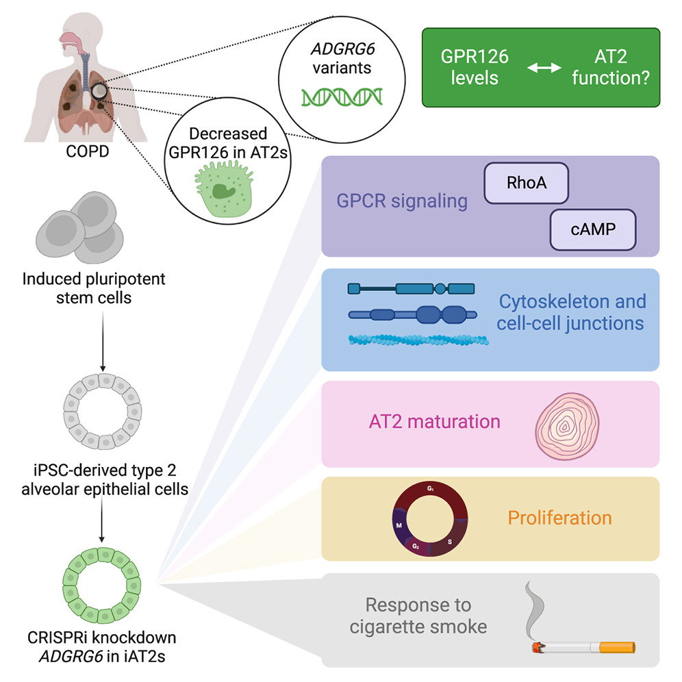

<style>
body {
  font-size: 16px;
}

caption {
  font-size: 14px;
  font-style: italic;
}
</style>

```{r setup, include=FALSE}
knitr::opts_chunk$set(
  echo = TRUE,
  warning = FALSE,
  message = FALSE,
  fig.align = "center"
)


# Load library
library("biomaRt")
library("ComplexHeatmap")
library("dplyr")
library("edgeR")
library("GEOquery")
library("ggplot2")
library("knitr")
library("RColorBrewer")
library("rmarkdown")
library("tidyr")
library("tibble")
library("gprofiler2")
```

---

# Introduction {#introduction}

Cigarette smoke exposure is a major environmental risk factor for chronic respiratory diseases, particularly chronic obstructive pulmonary disease (COPD). Understanding how genetic factors interact with smoke at the molecular level is a key focus of respiratory research. One gene of particular interest is ADGRG6 (also known as GPR126), identified through genome-wide association studies (GWAS) as a susceptibility locus for COPD [@werder2023adgrg6]. ADGRG6 functions as a "mechanosensor," helping lung cells maintain stability and repair themselves after injury. When this gene is disrupted, the lungs become significantly more vulnerable to environmental damage [@karlsson2013gpr126].

To investigate the role of ADGRG6 in lung function, researchers started to focusing on Alveolar Type 2 (AT2) cells, the "first responders" of the lungs that act as the primary defense and repair team for the tiny air sacs where gas exchange occurs. Using induced AT2 cells (iAT2s)—lab-grown versions derived from pluripotent stem cells (PSCs)—the researchers examined how ADGRG6 affects lung cells under both normal air and cigarette smoke conditions [@werder2023adgrg6]. The experimental design is summarized below:

<div align="center">
  
  <p><strong>Figure 1.1: Experiment Overview</strong> [@werder2023adgrg6]</p>
</div>

These "blank slate" cells underwent a multi-stage directed differentiation protocol—progressing from definitive endoderm to NKX2-1+ lung progenitors—using a precise cocktail of growth factors (e.g., BMP4 and CHIR99021) and 3D Matrigel culture to mature into functional iAT2 cells [@werder2023adgrg6]. To investigate the role of the COPD-linked gene ADGRG6, the researchers employed a doxycycline-inducible CRISPR interference (CRISPRi) system delivered via lentivirus, targeting the gene's transcription start site to achieve a 20%–50% reduction in expression, effectively mimicking the partial loss of function associated with genetic risk factors [@werder2023adgrg6].

Following the experimental perturbation, RNA-seq data were generated (GSE223077), and differential expression between ADGRG6 knockdown vs. wild-type iAT2s under smoke exposure was analyzed During my 1st assignment.

For this second Report, further analysis is performed on the RNA-seq dataset **GSE223077**. Specifically, the ranked gene list from the **ADGRG6 knockdown vs. wild-type under smoke exposure** comparison is used as the primary input for downstream pathway and network analyses to investigate the functional effects of **ADGRG6** perturbation [@werder2023adgrg6]. Two complementary pathway enrichment approaches are applied. First, **thresholded over-representation analysis (ORA)** is used to identify biological pathways enriched among significantly differentially expressed genes [@kolberg2020gprofiler2]. Second, **non-thresholded gene set enrichment analysis (GSEA)** is performed using the entire ranked gene list without applying a significance cutoff [@subramanian2005gene]. The enrichment results are subsequently visualized and interpreted using the **Cytoscape Enrichment Map pipeline**, which organizes enriched pathways into functional networks and broader biological themes [@shannon2003cytoscape].


## Dataset Review {#dataset}

### Dataset Info {#dataset-info}

The dataset used for this assignment **GSE223077** analyzed in this report originates from the study titled *“The COPD GWAS gene ADGRG6 instructs function and injury response in human iPSC-derived type II alveolar epithelial cells.”* The study investigates the functional role of the gene **ADGRG6**, which has been identified in genome-wide association studies (GWAS) as a risk locus for chronic obstructive pulmonary disease (COPD) [@werder2023adgrg6]. Using an inducible CRISPR interference (CRISPRi) system in human induced pluripotent stem cell–derived type II alveolar epithelial cells (iAT2s), the authors examined how perturbation of **ADGRG6** affects cellular processes involved in lung injury responses [@werder2023adgrg6]. Their findings suggest that **ADGRG6** influences several key biological pathways including cell adhesion, cytoskeletal organization, proliferation, and responses to cigarette smoke–induced injury, providing insight into gene–environment interactions in COPD pathogenesis [@werder2023adgrg6].


To investigate transcriptional changes associated with these perturbations, RNA sequencing was performed and differential gene expression analysis was conducted to compare experimental conditions. In Assignment 1, the RNA-seq count data were downloaded from GEO and processed in R. The dataset consists of 12 samples representing two experimental factors: **genotype** (wild-type vs. **ADGRG6** knockdown) and **exposure condition** (air vs. cigarette smoke). Each of the four genotype–exposure combinations contains three biological replicates, allowing comparison of transcriptional responses associated with **ADGRG6** perturbation as well as responses to cigarette smoke exposure.

```{r}
metadata <- data.frame(
  sample   = c(
    "WA_WR_0726_1", "WA_WR_0726_2", "WA_WR_0726_3",
    "WA_WR_0726_4", "WA_WR_0726_5", "WA_WR_0726_6",
    "WA_WR_0726_7", "WA_WR_0726_8", "WA_WR_0726_9",
    "WA_WR_0726_10", "WA_WR_0726_11", "WA_WR_0726_12"
  ),
  genotype = c(
    "WT","WT","WT",                     # 1–3
    "ADGRG6_kd","ADGRG6_kd","ADGRG6_kd", # 4–6
    "WT","WT","WT",                     # 7–9
    "ADGRG6_kd","ADGRG6_kd","ADGRG6_kd"  # 10–12
  ),
  exposure = c(
    "Air","Air","Air",                  # 1–3
    "Air","Air","Air",                  # 4–6
    "Smoke","Smoke","Smoke",            # 7–9
    "Smoke","Smoke","Smoke"             # 10–12
  ),
  stringsAsFactors = FALSE
)

knitr::kable(metadata)
```
Table 1.1: This table shows the experimental design and sample metadata for the GSE223077 series. Each row represents a unique RNA-seq library, and columns define the specific variables for each sample. 'Genotype' indicates whether the human iAT2 cells were Wild-Type (WT) or subjected to CRISPRi-mediated knockdown of the ADGRG6 mechanosensor (ADGRG6_kd). 'Exposure' identifies the treatment condition: Air (control) or Cigarette Smoke (test). The 'Sample' IDs correspond to the column names in the raw count matrix, where numbers 1–12 represent independent biological replicates.

<br>

Since this study is primarily concerned with the effect of ADGRG6 under smoking conditions, as emphasized by the author, **all subsequent analyses will focus on the differences in gene expression between WT and ADGRG6 knockout samples under smoke exposure.**


### Dataset Processing {#dataset-process}

Raw gene count data from **GSE223077** were imported into R and analyzed using the **edgeR** RNA-seq differential expression framework [@robinson2010edger]. Library sizes varied substantially across samples (approximately 4.3×10⁷ to 8.0×10⁷ reads per library), therefore normalization was required to make expression values comparable across samples. Gene expression values were transformed into **log2 counts per million (log-CPM)** using `edgeR::cpm()`, which normalizes counts relative to sequencing depth and stabilizes variance for downstream analysis [@robinson2010edger]. Summary statistics of the log-CPM distribution were used to assess overall expression variability across the dataset.


Differential expression analysis was then performed using the **edgeR quasi-likelihood (QL) generalized linear model pipeline** [@robinson2010edger]. Gene-wise dispersions, which represent biological variability between replicates, were estimated using `estimateDisp()`. A generalized linear model describing the experimental design was fitted to the normalized count data using `glmQLFit()` [@robinson2010edger].


Statistical testing for differential expression was conducted using **quasi-likelihood F-tests** (`glmQLFTest()`), which evaluate predefined contrasts between experimental conditions [@robinson2010edger]. Several contrasts were defined, including **wild-type air vs. smoke exposure**, **ADGRG6 knockdown vs. wild-type under air exposure**, and **ADGRG6 knockdown vs. wild-type under smoke exposure**. For each comparison, genes were ranked based on their differential expression statistics, including log2 fold-change, average log-CPM, and quasi-likelihood F-statistics. P-values were adjusted for multiple testing using the **Benjamini–Hochberg false discovery rate (FDR)** procedure.


To avoid retesting and save computational resources, resulting differential expression table for WT and ADGRG6_kd mice under smoke was saved at "data/tbl_wt_vs_kd_smoke.rds". Sample data is shown as follows:

```{r}
tbl_wt_vs_kd_smoke <- readRDS("data/tbl_wt_vs_kd_smoke.rds")

knitr::kable(head(tbl_wt_vs_kd_smoke, 6))
```
Table 1.2: This table showing the top 6 differentially expressed genes for the comparison between Wild-Type (WT) smoke vs **ADGRG6** knockdown smoke condition, calculated using the edgeR quasi-likelihood F-test pipeline. Each row represents a single gene identified by its HGNC symbol. Columns provide statistical metrics for the ‘WT_vs_**ADGRG6** knockdown’ contrast: ‘logFC’ represents the log2 fold-change, where positive values denote higher expression in **ADGRG6** knockdown cells and negative values indicate down-regulation in **ADGRG6** knockdown cells; ‘logCPM’ indicates the average log2 counts per million across all samples; ‘F’ is the quasi-likelihood F-statistic; ‘PValue’ is the raw probability value; and ‘FDR’ is the False Discovery Rate adjusted for multiple testing using the Benjamini-Hochberg method.

<br>

To view the full data exploration, quality control, and differential expression pipeline, please refer to my previous report: 
**[Assignment 1: Data Exploration and Differential Expression](https://bcb420-2026.github.io/Jay_Du/A1_JayDu.html)**.

---


# Thresholded Over-Representation Analysis (ORA) {#ora}

In this section, we perform thresholded over-representation analysis (ORA) to identify biological pathways enriched among significantly differentially expressed genes. ORA evaluates whether predefined gene sets occur more frequently in a list of significant genes than expected by chance. 

## Method selection {#ora-method}

The ORA was conducted using the **g:Profiler** tool (via the `gprofiler2` R package) [@kolberg2020gprofiler2]. This method was chosen because it is well-established for pathway enrichment analysis, integrates multiple annotation databases, and applies multiple testing correction (Benjamini–Hochberg FDR) to control for false positives. Additionally, g:Profiler provides outputs directly compatible with Cytoscape for downstream network visualization.

## Annotation data {#ora-annotate}

The analysis used the following curated annotation sources:

- **GO Biological Process (GO:BP) [@ashburner2000gene]:** Captures biological pathways and cellular processes relevant to gene function. Selected because the study focuses on cellular responses such as adhesion, cytoskeletal organization, proliferation, and injury response.  
- **KEGG [@kanehisa2000kegg]:** Includes well-established signaling and metabolic pathways.  
- **Reactome (REAC) [@gillespie2022reactome]:** Provides detailed mechanistic pathways for signaling and metabolic processes.  
- **WikiPathways (WP) [@martens2021wikipathways]:** Community-curated pathways capturing emerging or specialized biological processes.


## Data Analysis {ora-ana}

We first extracted the HGNC gene symbols from the gene list in order to prepare the data for functional enrichment analysis using g:Profiler. To enable a more detailed comparison of functional patterns, the genes were divided into three separate lists:

- A list containing all differentially expressed genes
- A list containing only up-regulated genes
- A list containing only down-regulated genes

Separating the genes in this way allows enrichment analysis to be performed independently for each group. This approach helps identify whether up-regulated and down-regulated genes are associated with different biological processes, pathways, or molecular functions, and also allows comparison with the enrichment results obtained from the complete gene set.


```{r}
# Get all genes' HGNC symbol
all_genes <- tbl_wt_vs_kd_smoke %>%
  pull(hgnc_symbol)

# Separate up- and down-regulated genes
up_genes <- tbl_wt_vs_kd_smoke %>%
  filter(logFC > 0) %>%
  pull(hgnc_symbol)

down_genes <- tbl_wt_vs_kd_smoke %>%
  filter(logFC < 0) %>%
  pull(hgnc_symbol)
```

---

The following are representative gene snippets from the three prepared lists:

<br>

**Top 10 expressed genes from the whole list**

```{r}
knitr::kable(
  data.frame(HGNC_Symbol = head(all_genes, 10))
)
```

**Top 5 genes expressed from the up-regulated list**

```{r}
knitr::kable(
  data.frame(HGNC_Symbol = head(up_genes, 5))
)
```

**Top 5 genes expressed from the down-regulated list**

```{r}
knitr::kable(
  data.frame(HGNC_Symbol = head(down_genes, 5))
)
```

<br>

Now we perform ORA using **gprofiler2** for three gene sets: all differentially expressed genes, up-regulated genes, and down-regulated genes [@kolberg2020gprofiler2]. As discussed [previously](#ora-annotate), the analysis focuses on **GO Biological Process (GO:BP), KEGG, Reactome, and WikiPathways** annotations, as these databases capture pathway-level biological processes relevant to the functional effects of **ADGRG6** perturbation [@ashburner2000gene, @kanehisa2000kegg, @gillespie2022reactome, @martens2021wikipathways].

Prior to enrichment analysis, genes were filtered using a significance threshold of **FDR < 0.05**. This threshold controls the false discovery rate after multiple testing correction and helps reduce background noise and false positives, ensuring that enrichment results reflect genuine biological responses rather than random variation.

Additionally, **electronic GO annotations (IEA)** were excluded. IEA annotations are automatically inferred computationally rather than manually curated, and may include less reliable or overly broad gene-function associations. By excluding these annotations, the enrichment analysis focuses on **experimentally supported and curated pathways**, improving the reliability and interpretability of the results.

Lastly, gene sets were filtered to include pathways containing 5–500 genes to improve the reliability of the ORA results. Very small gene sets can appear significant due to a few overlapping genes, while very large sets are often broad and less informative. Restricting pathway size focuses the analysis on well-defined biological processes with sufficient gene representation for robust enrichment.

```{r}
# Run enrichment for all genes
gost_all <- gost(
  query = all_genes,
  organism = "hsapiens",
  sources = c("GO:BP","KEGG","REAC","WP"),
  user_threshold = 0.05,
  correction_method = "fdr",
  exclude_iea = TRUE,
  significant = TRUE,
)

# Filter gene set size to 5-500
gost_all$result <- gost_all$result %>%
  filter(term_size > 5 & term_size < 500)

# Run enrichment for up-regulated genes
gost_up <- gost(
  query = up_genes,
  organism = "hsapiens",
  sources = c("GO:BP","KEGG","REAC","WP"),
  user_threshold = 0.05,
  correction_method = "fdr",
  exclude_iea = TRUE,
  significant = TRUE,
)

# Filter gene set size to 5-500
gost_up$result <- gost_up$result %>%
  filter(term_size > 5 & term_size < 500)

# Run enrichment for down-regulated genes
gost_down <- gost(
  query = down_genes,
  organism = "hsapiens",
  sources = c("GO:BP","KEGG","REAC","WP"),
  user_threshold = 0.05,
  correction_method = "fdr",
  exclude_iea = TRUE,
  significant = TRUE,
)

# Filter gene set size to 5-500
gost_down$result <- gost_down$result %>%
  filter(term_size > 5 & term_size < 500)
```


---

## Result {#ora-result}

### Gene set count {#ora-count}
Let's first have a look at the number of significant gene sets for each annotation data:  

<br>


**GO:BP**

```{r}
# Extract and print the number of significant gene sets returned for GO:BP
cat("Significant GO:BP pathways for All Significant genes:", 
    nrow(gost_all$result[gost_all$result$source == "GO:BP", ]), "\n")
cat("Significant GO:BP pathways for Up-regulated genes:", 
    nrow(gost_up$result[gost_up$result$source == "GO:BP", ]), "\n")
cat("Significant GO:BP pathways for Down-regulated genes:", 
    nrow(gost_down$result[gost_down$result$source == "GO:BP", ]), "\n")
```

<br>


**Reactome**  

```{r}
# Extract and print the number of significant gene sets returned for REAC
cat("Significant Reactome pathways for All Significant genes:", 
    nrow(gost_all$result[gost_all$result$source == "REAC", ]), "\n")
cat("Significant Reactome pathways for Up-regulated genes:", 
    nrow(gost_up$result[gost_up$result$source == "REAC", ]), "\n")
cat("Significant Reactome pathways for Down-regulated genes:", 
    nrow(gost_down$result[gost_down$result$source == "REAC", ]), "\n")
```

<br>


**KEGG**  

```{r}
# Extract and print the number of significant gene sets returned for KEGG
cat("Significant KEGG pathways for All Significant genes:", 
    nrow(gost_all$result[gost_all$result$source == "KEGG", ]), "\n")
cat("Significant KEGG pathways for Up-regulated genes:", 
    nrow(gost_up$result[gost_up$result$source == "KEGG", ]), "\n")
cat("Significant KEGG pathways for Down-regulated genes:", 
    nrow(gost_down$result[gost_down$result$source == "KEGG", ]), "\n")
```

<br>


**WikiPathways**

```{r}
# Extract and print the number of significant gene sets returned for WP
cat("Significant WikiPathways for All Significant genes:", 
    nrow(gost_all$result[gost_all$result$source == "WP", ]), "\n")
cat("Significant WikiPathways for Up-regulated genes:", 
    nrow(gost_up$result[gost_up$result$source == "WP", ]), "\n")
cat("Significant WikiPathways for Down-regulated genes:", 
    nrow(gost_down$result[gost_down$result$source == "WP", ]), "\n")
```

---

When ORA was performed using the combined list of all significant genes, a greater number of enriched pathways was detected compared to analyses using up-regulated and down-regulated genes separately. For example, for Reactome, 473 pathways were enriched using all significant genes, compared with 345 for down-regulated genes and 43 for up-regulated genes (473 > 345 + 43).  

The higher number of pathways identified in the combined analysis reflects the larger and more diverse gene set, which increases the probability that pathways containing both up- and down-regulated genes reach statistical significance. In contrast, analyzing genes separately highlights direction-specific enrichment, identifying pathways primarily associated with either transcriptional activation or repression. Consequently, the combined analysis provides a broader overview of affected biological processes, whereas separate analyses allow clearer interpretation of directional transcriptional responses associated with ADGRG6 perturbation.

<br>

### ORA Result Discussion {#ora-discuss}

Below are the top pathways with each three gene sets: all differentially expressed genes, up-regulated genes, and down-regulated genes

```{r}
# Function to format gost tables
format_gost <- function(gost_obj) {
  gost_obj$result %>%
    arrange(p_value) %>%                 # sort by p-value
    group_by(source) %>%                 # group by database
    slice_head(n = 5) %>%                # top 5 per source
    ungroup() %>%
    select(
      term_name,
      source,
      p_value,
      term_size,
      query_size,
      intersection_size,
      precision,
      recall
    )
}

# Top pathways for each gene set
top_all  <- format_gost(gost_all)
top_up   <- format_gost(gost_up)
top_down <- format_gost(gost_down)
```

<br>


**All Differentially Expressed Genes**

```{r}
knitr::kable(top_all, caption = "Top enriched pathways for all significant genes")
```

<br>


**Up-regulated Differentially Expressed Genes**

```{r}
knitr::kable(top_up, caption = "Top enriched pathways for up-regulated significant genes")
```

<br>


**Down-regulated Differentially Expressed Genes** 

```{r}
knitr::kable(top_down, caption = "Top enriched pathways for down-regulated significant genes")
```
Table 2. presents the top enriched pathways for downregulated significant genes. The term_name column lists the biological processes, pathways, or functions associated with the genes, while the source column indicates the database or ontology from which the term originates, such as GO:BP for Gene Ontology Biological Process or KEGG for pathway data. The p_value represents the statistical significance of the enrichment, with lower values indicating stronger enrichment. Term_size shows the total number of genes associated with each term in the database, whereas query_size indicates the total number of genes in the input list used for the enrichment analysis. Intersection_size refers to the number of genes in the input list that overlap with the term. Finally, precision represents the fraction of genes associated with the term among all input list genes mapped to any term, and recall indicates the proportion of genes associated with the term relative to all genes annotated to that term in the database.

---

These ORA results are consistent with key mechanisms discussed in the original study on ADGRG6 function in human iAT2 cells [@werder2023adgrg6]. Across multiple annotation databases, the coordinated suppression of pathways related to cell adhesion, cytoskeletal organization, extracellular matrix interactions, and regulation of cell projections, all of which are consistent with the paper’s observation that ADGRG6 knockdown impairs focal adhesion, actin cytoskeleton organization, and tight junction formation.

Specifically, **Gene Ontology** analysis highlighted down-regulation of plasma membrane bounded cell projection morphogenesis, neuron projection morphogenesis, and cell projection morphogenesis, indicating impaired formation and maintenance of cellular extensions. Pathways controlling small GTPase-mediated signal transduction and regulation of cell projection organization were also suppressed, reflecting reduced activity of RHO-family GTPases that regulate cytoskeletal dynamics.

**KEGG** pathway analysis further supports these trends, showing down-regulation for focal adhesion, adherens junctions, and regulation of the actin cytoskeleton. This is consistent with the reported decrease in integrins (ITGB1, ITGA2) and tight junction proteins. The appearance of the axon guidance pathway highlights broader effects on signaling networks that orchestrate cellular architecture. Crucially, the breakdown of these adhesion complexes and cytoskeletal networks is a recognized driver of epithelial barrier dysfunction, severely compromising tissue integrity and the epithelial repair responses typically observed in chronic airway diseases [@raby2023mechanisms].

**Reactome** analysis identified suppression of RHO, RAC1, and CDC42 GTPase cycles, as well as extracellular matrix organization and non-integrin membrane–ECM interactions, underscoring impaired coordination between the cytoskeleton and extracellular matrix.  

**WikiPathways** analysis confirmed the down-regulation of focal adhesion, ciliopathies, epithelial-to-mesenchymal transition (EMT)–related pathways, and TGF-β signaling. The suppression of EMT pathways is particularly notable. EMT involves large-scale cellular remodeling and requires significant cellular plasticity—a state transition that fundamentally relies on robust translational machinery and increased ribosome biogenesis to support new gene expression programs [@prakash2019ribosome]. The downregulation of these pathways suggests that ADGRG6 deficiency not only disrupts static structural adhesion but also impairs the dynamic plasticity required for cellular remodeling.

Together, these findings show that ADGRG6 knockdown diminishes cytoskeletal integrity and cell-cell adhesion in alveolar epithelial cells, aligning closely with the experimental observations, specifically the down-regulation of focal adhesion and actin cytoskeleton genes, reduced F-actin filament levels, decreased tight junction protein ZO-1, and the lowered transepithelial electrical resistance (TEER) in ALI cultures [@werder2023adgrg6].

---

# Non-thresholded Gene Set Enrichment Analysis (GSEA) {#gsea}

In this section, we perform **non-thresholded gene set enrichment analysis (GSEA)** to identify biological pathways enriched across the full ranked list of genes, without applying a significance cutoff. This approach complements the thresholded ORA by capturing coordinated changes in gene expression that may not reach statistical significance individually but act collectively within pathways.

## Data Setup {#gsea-setup}

The analysis was performed using the Gene Set Enrichment Analysis (GSEA) software, which implements a preranked GSEA algorithm. The **ranked gene list** was derived from the differential expression results for **ADGRG6 knockdown vs. wild-type under smoke exposure**, with ranking calculated as:

\[
\text{rank metric} = \text{sign}(\text{logFC}) \times -\log_{10}(\text{PValue})
\]

This metric prioritizes genes with both strong fold-changes and statistical significance.  

Below is the code used to generate ranking. Ranking was saved at data/my_ranked_genes.rnk :
```{r}
ranked_list <- tbl_wt_vs_kd_smoke %>%
  # Calculate rank metric: sign(logFC) * -log10(PValue)
  mutate(
    GeneName = hgnc_symbol,
    rank = sign(logFC) * -log10(PValue)
  ) %>%
  # Keep only the two required columns
  dplyr::select(GeneName, rank) %>%
  # Handle duplicates just in case (keeps the one with the highest absolute rank)
  group_by(GeneName) %>%
  slice_max(order_by = abs(rank), n = 1, with_ties = FALSE) %>%
  ungroup() %>%
  # Sort in descending order of rank
  arrange(desc(rank))
```

<br>

A **custom GMT file** with Version September 01 2025 from Bader's Lab was used for annotation gene sets [@baderlabgenesets]. File can be found at:   

`data/Human_GOBP_AllPathways_noPFOCR_no_GO_iea_September_01_2025_symbol.gmt`  

This custom gmt removes redundant parent or overlapping terms (noPFOCR) and excludes electronic annotations (no_GO_iea). This ensures that enriched pathways are specific, high-confidence, experimentally validated, and human-relevant, reducing noise and improving interpretability. Together, these filters enhance the robustness and consistency of results over time, so rerunning the analysis produces stable, biologically meaningful pathway enrichments.

---

## Data Analysis {#gsea-ana}

Result for preranked GSEA was saved under data/A2_GSEA.  

Out of the 6155 gene sets recognized by GSEA, 3617 gene sets were up-regulated and 2538 are down-regulated.

<br>

### Top Gene Set {#gsea-top-gene}

**Top 20 Up-regulated Gene Set from GSEA Result**

```{r}
knitr::include_graphics("data/A2_GSEA_pos_top20.png")
```
Table 3.1. **Gene Set Enrichment Analysis (GSEA) Results.** The table details the enrichment of predefined biological pathways within the dataset. The GS (Gene Set) column identifies the specific pathway analyzed, with external database links provided in GS DETAILS. SIZE indicates the number of genes from that set found in the current dataset. The primary statistic, ES (Enrichment Score), measures the overrepresentation of these genes at the extremes of the ranked gene list, which is then adjusted for gene set size to produce the NES (Normalized Enrichment Score) for fair comparison across different pathways. Statistical significance is evaluated using the unadjusted NOM p-val (Nominal p-value), as well as two metrics corrected for multiple hypothesis testing: the standard FDR q-val (False Discovery Rate) and the stricter FWER p-val (Family-Wise Error Rate). RANK AT MAX identifies the exact position in the ranked list where the peak enrichment score occurs, while the LEADING EDGE metrics (tags, list, and signal) quantify the core subset of genes primarily responsible for driving the observed enrichment signal.

<br>

In the smoke condition, gene sets positively enriched in wild-type cells relative to ADGRG6-knockdown cells were predominantly associated with protein synthesis, translation, and cell-cycle progression. This indicates that wild-type iAT2 cells maintain higher activity of transcriptional and translational programs when exposed to smoke, whereas these processes appear reduced in ADGRG6-deficient cells.

Several hallmark pathways highlight this trend. The strongest enrichment was observed for HALLMARK_E2F_TARGETS and HALLMARK_MYC_TARGETS_V1, which represent transcriptional programs controlling cell-cycle progression and ribosome biogenesis. Similarly, HALLMARK_G2M_CHECKPOINT indicates increased activity of genes involved in mitotic progression and DNA replication.

<br>

**Top 20 Down-regulated Gene Set from GSEA Result**

```{r}
knitr::include_graphics("data/A2_GSEA_neg_top20.png")

```

<br>

In contrast, gene sets negatively enriched in wild-type cells (therefore relatively higher in ADGRG6 knockdown cells) were primarily associated with cell adhesion, cytoskeletal organization, extracellular matrix interactions, and epithelial structural programs. These results indicate that genes involved in maintaining epithelial architecture and cell-cell connectivity show reduced expression in wild-type cells compared with knockdown under smoke exposure.

Several enriched pathways illustrate this pattern. The Cadherin signaling pathway and multiple Gene Ontology terms related to cell–cell adhesion, cell junction assembly, and cell junction organization were strongly enriched. These pathways regulate formation of adherens junctions and epithelial cell connectivity.

Structural cytoskeletal processes were also prominent, including intermediate filament–based processes, intermediate filament cytoskeleton organization, and actin cytoskeleton organization, indicating alterations in cytoskeletal architecture. Additional pathways involved extracellular matrix organization, collagen degradation, and activation of matrix metalloproteinases, which regulate matrix remodeling and tissue structure.

Other enriched processes included epidermis development, keratinization, and keratinocyte differentiation, which reflect epithelial differentiation programs. Together with enrichment for neuron projection guidance and axonogenesis regulation, these findings suggest broad effects on pathways that control cellular morphology and structural organization.

In conclusion, the negatively enriched pathways highlight alterations in adhesion, cytoskeletal integrity, and extracellular matrix signaling, suggesting that ADGRG6 status influences structural and adhesion-related gene programs during smoke exposure.

---

## GSEA Result Summary {#gsea-summary}

Overall, the enrichment results strongly support the mechanisms reported in the original study. As the paper demonstrated, ADGRG6 regulates focal adhesions, cytoskeletal organization, tight junctions, and cell proliferation in iAT2 cells, and that knockdown of ADGRG6 alters these pathways, particularly during cigarette smoke exposure [@werder2023adgrg6].

The enrichment analysis performed here identified many of the same biological processes. In the down-regulated pathways, there was strong enrichment for processes related to cell adhesion, cytoskeletal organization, and extracellular matrix interactions, including focal adhesion, cell junction assembly, cadherin signaling, actin cytoskeleton organization, and extracellular matrix organization. These findings are consistent with the study’s observation that ADGRG6 knockdown reduces expression of integrin genes and disrupts focal adhesion and actin cytoskeleton pathways [@werder2023adgrg6].

Similarly, the positively enriched gene sets in the smoke condition were dominated by cell-cycle and proliferation pathways, including E2F targets, MYC targets, and G2/M checkpoint signaling. This pattern also agrees with the findings reported in the paper, where gene set enrichment analysis showed that cell-cycle pathways such as MYC and E2F signaling were up-regulated following ADGRG6 knockdown, reflecting increased proliferative activity in the cells [@werder2023adgrg6].

Taken together, these results suggest that the enrichment analysis successfully recapitulates the central biological mechanisms described in the study: ADGRG6 contributes to maintenance of epithelial structure and adhesion, and its loss leads to reduced structural integrity but increased proliferative signaling [@werder2023adgrg6].


---

# Enrichment Map Visualization {#cytoscape}

The non-thresholded GSEA results were then visualized using the Cytoscape Enrichment Map pipeline [@shannon2003cytoscape]. Cytoscape is a versatile open-source software platform for visualizing complex networks and integrating them with attribute data [@shannon2003cytoscape]. Its Enrichment Map plugin allows for intuitive visualization of gene set enrichment results as a network of interconnected pathways, making it easier to identify overarching biological themes and relationships that might be overlooked in traditional tabular outputs [@reimand2019pathway]. This approach enhances the interpretability of GSEA results by providing a global view of functional enrichments and their overlaps.


## Network Annotation {#cytoscape-annotate}

The GSEA results were directly imported using the EnrichmentMap plugin’s ‘Scan Folder’ function [@reimand2019pathway].

The resulting network consisted of **1640 nodes** and **16734 edges**, with nodes representing enriched pathways and edges representing gene overlap between pathways. This network was annotated using the **AutoAnnotate** app with default settings [@reimand2019pathway]. Clustering was performed using the **Markov Cluster Algorithm (MCL)**, and cluster labels were automatically generated via the **WordCloud algorithm** applied to the GS_DESCR (Gene Set Description) column. 

To improve readability and reduce visual overlap of nodes and edges, the **Layout Cluster** feature in Cytoscape was applied, ensuring that clusters were spatially separated and easier to interpret [@reimand2019pathway]. Edge filtering at a **similarity coefficient ≥ 0.5** prevented the network from becoming overly dense, while nodes were included only if **FDR < 0.05**.  

This approach summarized the main biological themes within each cluster while maintaining a clean and interpretable visualization.

The network was annotated based on the **GO:BP dataset** as described in the [GSEA setup](#gsea-setup) [@baderlabgenesets].

---

## Overview {#cytoscape-overview}

The figure below shows the enrichment map prior to manual layout adjustments, with clusters highlighted and labeled according to their primary biological function:

```{r, fig.cap="Enrichment Map network of gene set enrichment. Nodes represent distinct biological pathways, where node size indicates the gene count. Edges connect pathways that share genes; edge thickness represents the overlap size, while edge color typically denotes the source dataset in multi-dataset comparisons. The large shaded circles group highly interconnected nodes into functional clusters, labeled with overarching biological themes (e.g., 'collagen matrix'). The initial 'raw' network often appears as a messy, densely tangled 'hairball' because gene set databases are inherently highly redundant—many distinct pathways share the exact same core genes. Without applying strict statistical filters (like a lower FDR cutoff) or higher gene-overlap thresholds, every minor shared gene creates a visible edge, leading to massive visual clutter."}

knitr::include_graphics("data/A2_raw_layout.png")
```

<br>

After applying the filters mentioned above and performing some manual rearrangements, the graph became clearer.

```{r, fig.cap="Filtered EnrichmentMap network highlighting key biological pathways. With stricter overlap and significance thresholds applied, distinct functional clusters emerge, such as those related to recombinational DNA repair, independent proteasomal degradation, and mitotic transitions. This refined layout isolates the most prominent biological themes, removing minor overlaps to allow for a clearer interpretation of the core processes driving the dataset."}

knitr::include_graphics("data/A2_cytoscape.png")
```

---

## Network Interpretation {#cytoscape-ana}

The enrichment map reveals several interconnected biological themes based on the clustered pathways. One of the most prominent themes involves **cell cycle regulation and mitotic progression**. Multiple clusters contain pathways related to mitotic checkpoints, positive and negative regulation of mitotic transition, cytokinesis, and APC/C-mediated cell cycle control. Together, these pathways indicate strong enrichment of genes involved in controlling cell division and ensuring accurate chromosome segregation. This theme is consistent with the experimental findings that ADGRG6 knockdown increases proliferation in iAT2 cells, with more cells entering S and G2/M phases.

Another major theme is **DNA replication, repair, and genome maintenance**. Clusters labeled with processes such as recombinational DNA repair, replication maintenance, post-replication repair, and telomere regulation indicate that pathways responsible for maintaining genome stability are highly represented. These processes are closely linked to the cell cycle, as DNA repair mechanisms must coordinate with replication and mitosis to prevent genomic instability during cell proliferation.

A third theme centers on **chromatin organization and epigenetic regulation**. Pathways involving chromatin remodeling, nucleosome complex disassembly, chromatin condensation, and cohesin-mediated chromosome organization appear grouped together in the network. These processes regulate DNA accessibility and chromosome structure, which are essential for proper transcription, replication, and chromosome segregation during cell division.

Finally, smaller clusters indicate processes related to **cellular structure and metabolism**, including integrin interactions, tight junction maintenance, mitochondrial activity, and metabolic pathways such as the TCA cycle and hexose phosphate processes. These pathways may reflect broader cellular adaptations associated with altered proliferation and cellular function following ADGRG6 perturbation.

Overall, the enrichment map indicates that the major biological themes are centered around cell cycle regulation, genome stability, and chromatin organization, with additional contributions from pathways involved in RNA processing and cellular metabolism. These enriched processes collectively point toward mechanisms associated with cell proliferation, DNA maintenance, and structural organization of the cell. Such patterns strongly supported the original paper's experimental observations that ADGRG6 knockdown promotes increased proliferation and influences cytoskeletal organization and cell–cell junction pathways in alveolar epithelial cells [@werder2023adgrg6].

<br>

### Novel pathway - SARS-CoV infection

Some clusters also highlight pathways related to SARS-CoV infection, which may initially appear unexpected but are biologically plausible in this context. Because alveolar type II epithelial (AT2) cells are key target cells for respiratory viruses, enrichment of pathways associated with viral infection likely reflects broader host cellular responses involved in epithelial defense, stress responses, and regulation of transcription and translation during infection. Many viral infection pathways share genes involved in RNA processing, protein synthesis, and immune or stress signaling, which can overlap with pathways regulating epithelial cell function. Therefore, the presence of SARS-CoV infection–related pathways in the network is reasonable and may reflect shared molecular mechanisms between viral response pathways and the cellular processes affected by ADGRG6 knockdown in respiratory epithelial cells.

---

# Conclusions {#conclusion}

The pathway enrichment analyses, both ORA and GSEA, provide a striking view of the transcriptional consequences of ADGRG6 knockdown in iAT2 cells under cigarette smoke exposure. The ORA results immediately draw attention to suppression of pathways central to cell adhesion, cytoskeletal organization, and extracellular matrix interactions, reinforcing the idea that ADGRG6 plays a key role in maintaining epithelial structure [@kolberg2020gprofiler2]. Conversely, GSEA revealed that cell-cycle and proliferation pathways are relatively more active in ADGRG6-deficient cells, suggesting a compensatory or deregulated proliferative response when structural integrity is compromised [@subramanian2005gene].

The Cytoscape enrichment map brings these insights to life, allowing us to see how interconnected these biological processes truly are [@shannon2003cytoscape]. The network makes it clear that themes like cell cycle control, genome maintenance, and chromatin organization dominate the transcriptional landscape, while smaller but meaningful clusters point to metabolism, RNA processing, and even pathways related to viral infection. The inclusion of SARS-CoV–related pathways may at first seem tangential, but upon reflection, it underscores how AT2 cells share core regulatory circuits for stress, translation, and immune responses that are engaged both during viral infection and in response to structural perturbation.

Subjectively, what stands out is the cohesive story the data tell: ADGRG6 knockdown shifts the balance from structural maintenance toward proliferative and cell-cycle activity, while simultaneously affecting broader cellular programs that intersect with immune and stress responses. The integration of ORA, GSEA, and network visualization not only confirms previously reported findings but also reveals subtle, potentially overlooked themes, emphasizing the power of combining thresholded, non-thresholded, and network-level approaches to fully interpret complex RNA-seq datasets.

---

# Questions

## Thresholded over-representation analysis

**Which method did you choose and why?**

[Method](#ora-method)  


<br>

**What annotation data did you use and why? What version of the annotation are you using?**  

I originally intended to use a custom GMT file, but it is only available via the web interface, which threw a parseError upon loading. Therefore, I used the gProfiler2 R package instead, relying on its internal, up-to-date database annotations.  

```{r}
# Create a dataframe of the annotation versions used in the analysis
annotation_versions_df <- data.frame(
  Source = c("Ensembl (Gene Build)", "GO:BP / CC / MF", "KEGG", "Reactome (REAC)", "Human Protein Atlas", "miRTarBase"),
  Version_Release = c("Release 113 (e113_eg59_p19)", "2025-03-16", "2024-01-22", "2025-05-23", "2024-10-19", "Release 10.0")
)

# View the table
knitr::kable(annotation_versions_df, caption = "Annotation Dataset Versions")
```


<br>

**How many gene sets were returned with what thresholds?**  

[Counts](#ora-count)  


<br>

**Run the analysis using the up-regulated set of genes, and the down-regulated set of genes separately. How do these results compare to using the whole list (i.e all differentially expressed genes together vs. the up-regulated and down regulated differentially expressed genes separately)?**  

When ORA was performed using the combined list of all significant genes, a greater number of enriched pathways was detected compared to analyses using up-regulated and down-regulated genes separately. For example, for Reactome, 473 pathways were enriched using all significant genes, compared with 345 for down-regulated genes and 43 for up-regulated genes (473 > 345 + 43).  

The higher number of pathways identified in the combined analysis reflects the larger and more diverse gene set, which increases the probability that pathways containing both up- and down-regulated genes reach statistical significance. In contrast, analyzing genes separately highlights direction-specific enrichment, identifying pathways primarily associated with either transcriptional activation or repression. Consequently, the combined analysis provides a broader overview of affected biological processes, whereas separate analyses allow clearer interpretation of directional transcriptional responses associated with ADGRG6 perturbation.


<br>

**Do the over-representation results support conclusions or mechanism discussed in the original paper? Can you find evidence, i.e. publications, to support some of the results that you see. How does this evidence support your results.**

[Discussion](#ora-discuss)

---

## Non-thresholded Gene set Enrichment Analysis

**What method did you use? What gene sets did you use? Make sure to specify versions and cite your methods.**  

[Setup](#gsea-setup)  

<br>

**How do these results compare to the results from the thresholded analysis in Assignment #2. Compare qualitatively. Is this a straight forward comparison? Why or why not?**

In theory, non-thresholded Gene Set Enrichment Analysis (GSEA) can detect pathway-level changes that thresholded methods such as Over-Representation Analysis (ORA) may miss. However, in this specific analysis the overall biological conclusions from both approaches were largely consistent, leading to a straight forward comparison.

Both the thresholded ORA results from Assignment 2 and the non-thresholded GSEA results identified enrichment of pathways related to cell cycle regulation, protein synthesis, and RNA processing, as well as pathways associated with cell adhesion, cytoskeletal organization, and extracellular matrix interactions. For example, ORA identified enrichment of processes such as cell cycle phase transition, ribosome biogenesis, and mRNA processing, while the GSEA results highlighted similar biological programs through gene sets such as E2F targets, MYC targets, G2/M checkpoint, and translation-related pathways. Likewise, both analyses detected pathways related to focal adhesion, actin cytoskeleton organization, and cell junction assembly, which are consistent with the mechanisms described in the original study.

Because the differential expression signal in this dataset appears relatively strong, many genes involved in these pathways passed the significance thresholds used in ORA. As a result, the thresholded method was still able to capture the same major biological themes that were detected by GSEA. The primary difference is therefore not in the biological interpretation, but in the strength and structure of the enrichment signals: GSEA highlights coordinated shifts across the entire ranked gene list and often shows stronger pathway-level enrichment, while ORA focuses only on genes that exceed predefined significance thresholds.

Overall, in this case the non-thresholded GSEA analysis did not reveal entirely new biological mechanisms compared with the thresholded ORA results, but it provided additional support and clearer pathway-level evidence for the same processes affected by ADGRG6 knockdown.


<br>

**How many nodes and how many edges in the resulting map? What thresholds were used to create this map?**

**1640 nodes** and **16734 edges**. I used **fdr < 0.05** for nodes and **similarity coefficient ≥ 0.5** for edges cut off for a cleaner and more interpretable visualization.


<br>

**What parameters did you use to annotate the network?**

The network was annotated using the AutoAnnotate app in Cytoscape and GO:BP annotation dataset as mentioned in [GSEA](#gsea-setup). To prevent the network from becoming an unreadable 'hairball,' an edge cutoff threshold of 0.5 similarity coefficient was applied. The network was clustered using the MCL (Markov Cluster Algorithm). Cluster labels were generated using the WordCloud algorithm, which analyzes the GS_DESCR (Gene Set Description) column to summarize the central biological functions of each grouped cluster.

Scale font by cluster size was uncheck so that smaller node can wtill be visible. Font size was set to 20.

Lay out cluster to minimize overlap was use to get a good start for manual rearrangement.


<br>

**What are the major themes present in this analysis? Do they fit with the model? Are there any novel pathways or themes?**

[Theme](#cytoscape-ana)


<br>

**Do the enrichment results support conclusions or mechanism discussed in the original paper? How do these results differ from the results you got from Assignment #2 thresholded methods?**

1. [Yes](#gsea-summary)

2. As mentioned in previous question, in theory, non-thresholded Gene Set Enrichment Analysis (GSEA) can detect pathway-level changes that thresholded methods such as Over-Representation Analysis (ORA) may miss. However, in this specific analysis, the overall biological conclusions from both approaches were largely consistent. As the differential expression signal in this dataset appears relatively strong, many genes involved in these pathways passed the significance thresholds used in ORA. As a result, the thresholded method was still able to capture the same major biological themes that were detected by GSEA. 

<br>

**Can you find evidence, i.e. publications, to support some of the results that you see. How does this evidence support your result?**

Evidence from previous studies supports several of the biological processes identified in the enrichment analysis. One major group of enriched pathways in this analysis involved ribosome biogenesis, RNA processing, and translation-related pathways. A study by Prakash et al. (2019)[@prakash2019ribosome] demonstrated that ribosome biogenesis is closely linked to cellular growth programs and can drive major cellular state transitions such as epithelial–mesenchymal transition (EMT). The authors showed that increased ribosome biogenesis and rRNA synthesis support transcriptional programs that promote cellular plasticity and migration during EMT [@prakash2019ribosome].
This supports the enrichment results observed here, where pathways such as ribosome biogenesis, translation, and protein synthesis were strongly enriched. These findings suggest increased biosynthetic and transcriptional activity in the affected cells, consistent with known roles of ribosome biogenesis in regulating cell growth and cellular state changes.

Another group of enriched pathways involved cell adhesion, cytoskeletal organization, extracellular matrix interactions, and epithelial structural pathways. These findings are supported by the review by Raby et al. (2023)[@raby2023mechanisms], which describes how airway epithelial integrity depends on proper regulation of junctional complexes, cytoskeletal organization, and epithelial barrier maintenance. The review highlights that environmental stressors such as pollutants or cigarette smoke can disrupt epithelial junctions, impair barrier function, and promote abnormal repair processes in airway diseases such as asthma and COPD [@raby2023mechanisms].
These mechanisms align with the enrichment results in this analysis, where pathways related to cell junction assembly, cadherin signaling, actin cytoskeleton organization, and extracellular matrix organization were significantly enriched. Together, these studies provide biological evidence that the pathways identified in the enrichment analysis are consistent with known mechanisms regulating epithelial structure, repair, and cellular remodeling.

---

# References {#references}
